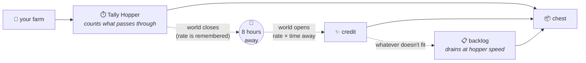

# Tally Hopper

A Minecraft mod that lets you turn your computer off at night instead of leaving an AFK farm running.

> **Status: pre-alpha.** Under active development. See the [roadmap](docs/ROADMAP.md).

## How it works

A Tally Hopper is a hopper that keeps a tally. It watches what flows through it, works out your
farm's real rate, and pays you that rate for the real-world hours your world was closed.



1. **Craft one.** `hopper + clock + any sapling`, or use a clock on a hopper already in your farm —
   sneak-use finds the end of a hopper chain for you. The clock is not consumed; the sapling is.
2. **Calibrate.** Put a sapling in the hopper's screen. It spends one and watches for five minutes,
   then the bar turns green and it is ready. It only needs a sapling to calibrate, never to run.
3. **Leave.** Close your world. The mod records the real-world time at the last heartbeat.
4. **Return.** Each hopper credits `rate × time away` into the storage it faces. A chat line tells you
   what you earned, and roughly how much electricity you did not spend to earn it.

It is **strictly additive**. It never removes, replaces or rearranges items you already have.

## Where to put one

**Put it at the end of your farm, facing the storage.** That is the only placement that matters.

| Placement                               | What happens                                                                                                                          |
| --------------------------------------- | ------------------------------------------------------------------------------------------------------------------------------------- |
| Facing a chest, barrel or modded drawer | Credit is delivered in one go when you return. This is what you want.                                                                 |
| Facing another hopper                   | Line mode: credit drains one item at a time at vanilla speed, so item sorters and filter hoppers are never jammed by a bulk delivery. |
| Facing nothing                          | Credit waits in the backlog until there is somewhere to put it.                                                                       |
| Mid-chain, several in one line          | Only the last one credits. The ones above it read *Passthrough*: they still measure, but never pay for items the last one pays for.   |

A few rules of thumb:

- **One per farm, at the end.** A Tally Hopper measures what passes through *it*, so a hopper that
  only sees part of your output only credits that part.
- **Its chunk has to be ticking** while you play. A hopper in a chunk nobody loads is asleep, measures
  nothing, and earns nothing. Spawn chunks and `/forceload` keep one awake; being merely loaded at the
  edge of your view distance is not enough. See [compatibility](docs/compatibility.md).
- **Check it with the screen or `/tallyhopper info`** before trusting it: the tooltip shows the rate
  per item, the delivery mode and where a line ends.

## Limits

These are deliberate, not missing features.

- **A hopper's own throughput is the ceiling.** No hopper credits more than 9,000 items an hour —
  one item every eight ticks, what a hopper can physically move. A real farm is never held back by it;
  a five-minute burst of hand-fed items is. See [ADR-0007](docs/adr/0007-bounding-credited-rates.md).
- **A fresh measurement is worth less.** A rate is scaled by how much of the last hour the hopper
  actually watched, so a hopper that calibrated five minutes ago credits a twelfth. The screen says so.
- **24 hours per absence**, by default. A longer gap is cut to the cap and you are told.
- **One million items of backlog**, by default. Beyond that, credit is simply not created — nothing
  you already have is ever touched to make room.
- **Plain items only.** Anything with enchantments, a custom name or other data is not counted and
  not credited.
- **Items you put in by hand are not counted**, whether through the screen or thrown in. Only what
  flows through the hopper on its own counts; blocks you mine or chop above it still do.
- **Time counts only while the world is closed.** On a server that stays up you were never away, so
  nothing is credited; a mode for time a chunk spends unloaded is on the v2 list.

## Settings

Gamerules, all prefixed `tallyhopper:`:

| Gamerule                  | Default   | What it does                                                   |
| ------------------------- | --------- | -------------------------------------------------------------- |
| `max_offline_hours`       | 24        | The most real-world time one closed session can earn.          |
| `max_items_per_hour`      | 9000      | The most one hopper credits per hour, across every item.       |
| `backlog_cap`             | 1,000,000 | The most items one hopper's backlog holds.                     |
| `min_observation_minutes` | 5         | How long a hopper watches before its rate earns credit (1–60). |
| `rejoin_summary`          | true      | Whether to say in chat what your hoppers earned.               |

`config/tallyhopper.json` holds the energy-estimate factors; the numbers behind them are in the
[methodology](docs/methodology.md).

## Requirements

| Requirement | Version                             |
| ----------- | ----------------------------------- |
| Minecraft   | 26.3 (Java Edition)                 |
| Loaders     | Fabric (with Fabric API) · NeoForge |
| Java        | 25                                  |
| License     | [MIT](LICENSE)                      |

## Why not a datapack?

Datapacks can't read the real-world clock, and they get no signal when the world closes.
The reasoning is in [ADR-0001](docs/adr/0001-mod-not-datapack.md).

## Development

Requirements: JDK 25 (`brew install --cask temurin@25`) and [uv](https://docs.astral.sh/uv/).

```sh
make -C .devtools setup               # pinned tools + git hooks
make -C .devtools check               # lint + build + tests (same as CI)
make -C .devtools run-fabric          # dev client (Fabric)
make -C .devtools run-neoforge        # dev client (NeoForge)
make -C .devtools stray               # JVMs a dev run left behind
```

Read [CONTRIBUTING.md](CONTRIBUTING.md) before opening a PR, and [docs/](docs/README.md) for the
roadmap, the decision records and the manual test script.
